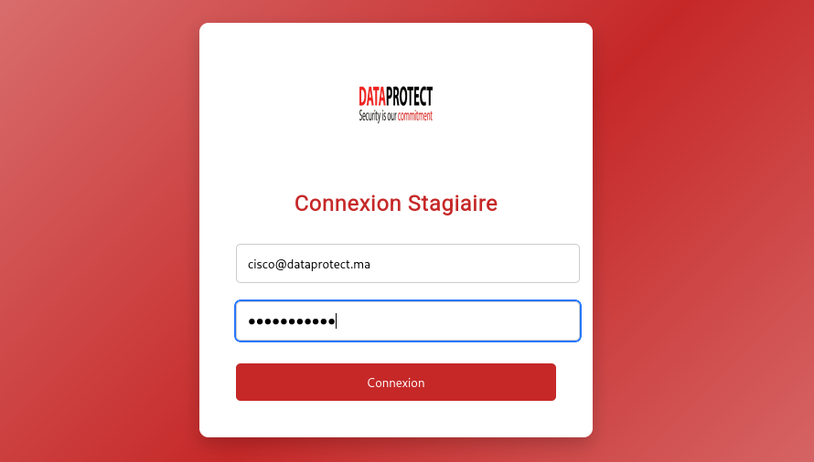
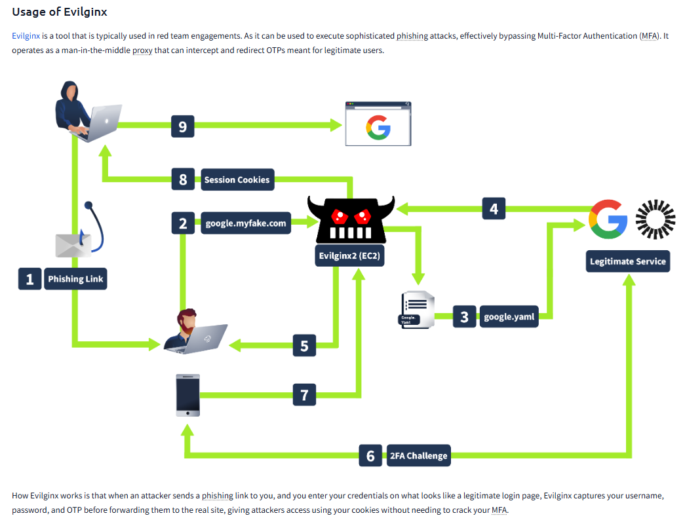
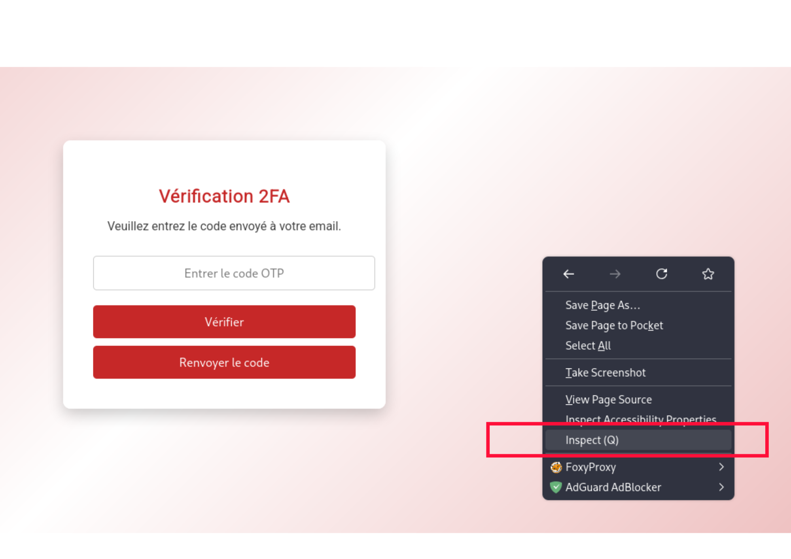
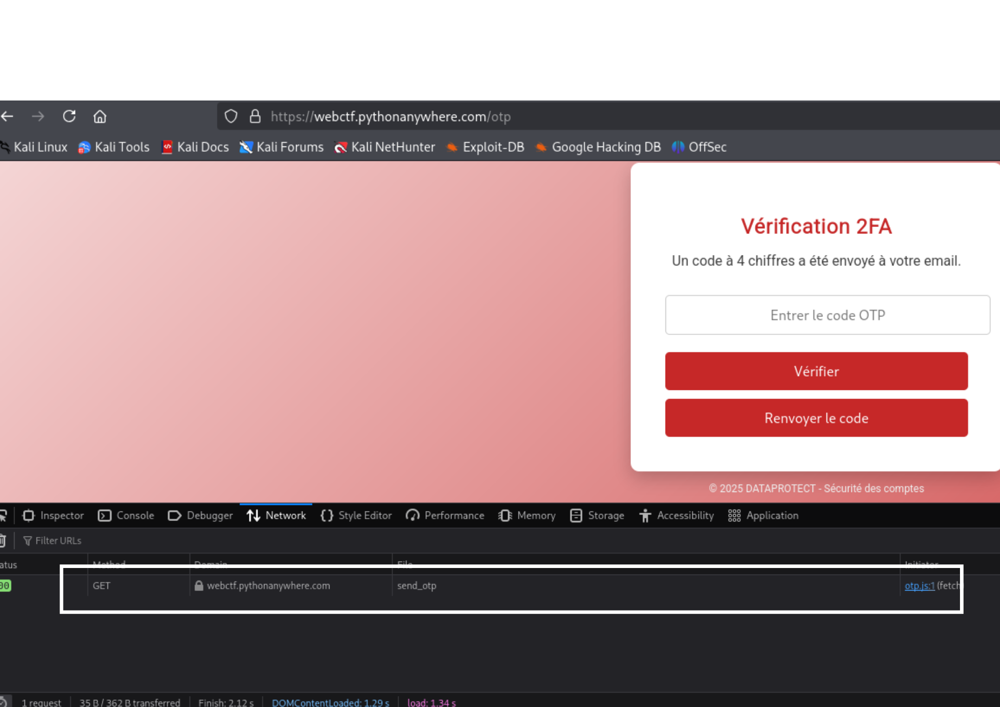
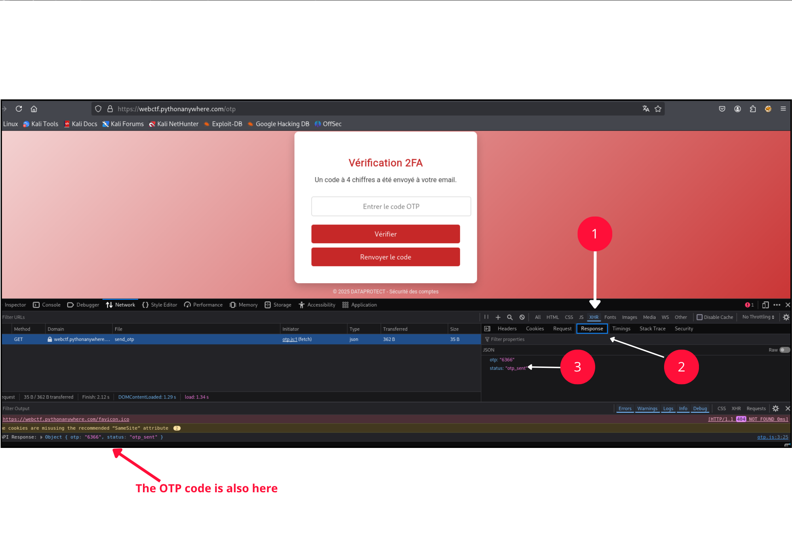
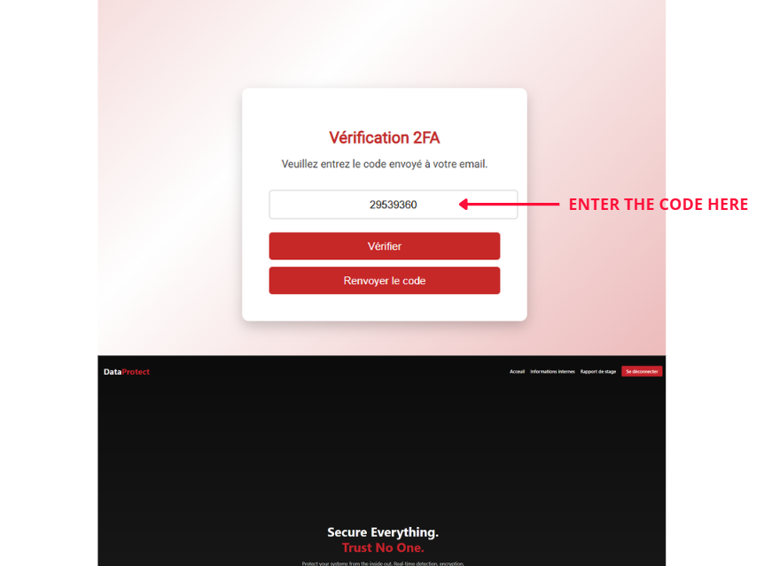
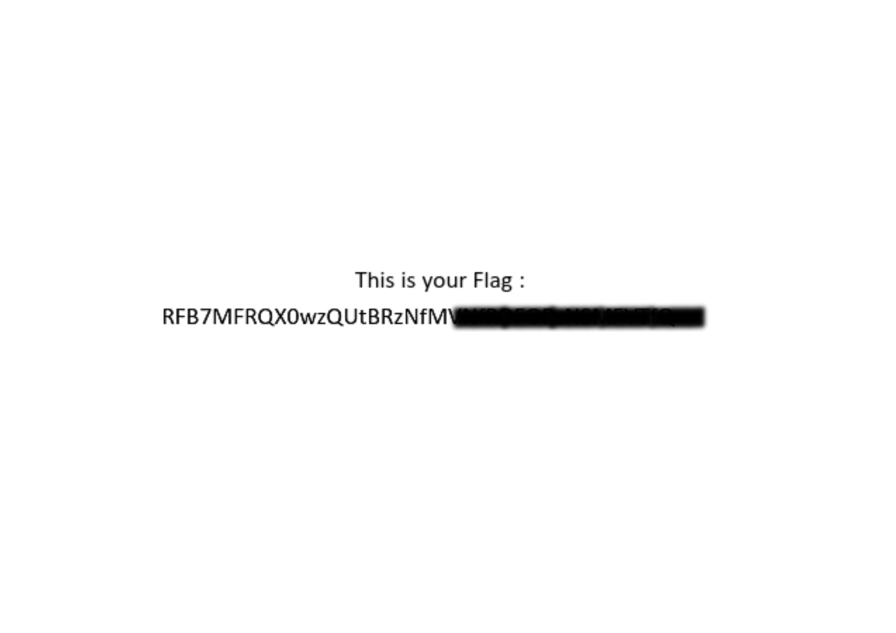
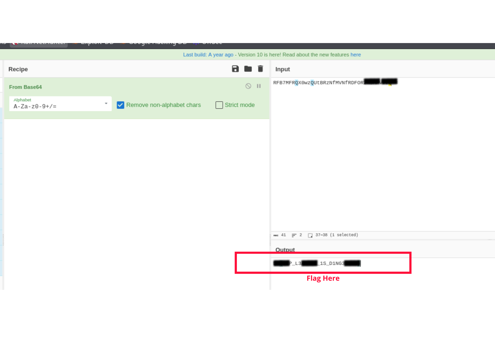

# WRITEUP FOR OTP LEAKAGE CHALLENGE

## 1 - Introduction
Ce challenge consiste à exploiter un site web dont le système d'authentification à deux facteurs (2FA) est mal implémenté par le développeur.
**L'objectif est de démontrer à quel point une erreur dans la logique ou la conception du code peut être dangereuse.** Il est donc essentiel que les développeurs restent vigilants, se forment continuellement et se tiennent informés des menaces et des technologies actuelles.

__NB : Niveau du challenge : Facile__
Bien que ce challenge soit de niveau **facile**, une connaissance préalable du fonctionnement du **MFA (Multi-Factor Authentication)** et de ses vulnérabilités est recommandée pour bien le comprendre et le résoudre.

**⚠️ Avertissement ⚠️**

Le **brute force** est strictement interdit sur ce challenge. *Toute tentative excessive d'accès ou d'essai de codes à répétition sera détectée automatiquement.*
En cas d'abus, *vous serez bannie de la plateforme, et vous ne pourrez plus retenter ce challenge.*
Merci de respecter l'esprit du CTF et de privilégier une approche logique et méthodique.

## 2- Description du challenge
__Nom du challenge : Ooops-T-P Leakage__

Level: __Easy__

Tu as trouvé par hasard les identifiants d’un stagiaire chez DataProtect, écrits sur un bout de papier :

**Email : cisco@dataprotect.ma**

**Mot de passe : password123**

Ta mission est de te connecter à la plateforme réservée au stagiaire via ce lien :
https://webctf.pythonanywhere.com/

Le site utilise une authentification à deux facteurs (2FA) pour renforcer la sécurité, mais le développeur a commis une erreur dans son implémentation.

Ton objectif est de contourner ce 2FA en découvrant le code à 4 chiffres, mal protégé, pour accéder au compte et trouver le flag.

## 3- Analyse
Nous avons réussi à utiliser les identifiants (credentials), mais une barrière de double authentification (2FA) via un OTP (One-Time Password) nous empêche d'aller plus loin. Le code est envoyé à l'adresse email de cisco, à laquelle nous n'avons pas accès

**Que peut-on faire dans ce cas ?**

Selon la description du challenge, le développeur a mal implémenté le mécanisme de double authentification. Cela signifie qu’il est vulnérable.
Cependant, nous ne savons pas encore comment identifier ou exploiter cette faille.

**Vulnérabilités récurrentes dans le MFA (Multi-Factor Authentication)**

**Mais alors, quelle est la vulnérabilité laissée par notre développeur ?**

Comme le nom du challenge l'indique : "Ooops-T-P Leakage", cela semble lié à une fuite du code OTP (One-Time Password). Le nom est un jeu de mots sur "OTP Leak" — une indication claire qu'une erreur permet d'accéder à ce code.

## 4- Exploitation
Tutoriel 1 : Utilisation de l’inspecteur de votre navigateur

**Hint : Si vous avez bien lu ceci, vous pensez sûrement à vérifier les requêtes XHR dans les réponses HTTP.*

**Step 1 : Connectes-toi avec l'identifiant trouvé**

**Step 2 : Capturer le code OTP (One Time Password !)**

Comme nous n’avons pas accès à la boîte mail du compte, nous allons exploiter la faille laissée par le développeur.

**Fais un clic droit sur la page, puis choisis "Inspecter" pour ouvrir les outils de développement.**

**Step 3 : Vérifier les requêtes réseaux**

**1 - Va dans l’onglet *Network* des outils de développement.**

**2 - Recharge la page (Ctrl + R ou F5)**

**3 - Observe les requêtes qui s’affichent, en particulier celles marquées XHR ou liées à des API.**

*Clique la requête appelée /api/send_otp ou équivalente.*

**Juste à droite :**

**1- Clique sur l’onglet *XHR (XMLHttpRequest)*.**

**2- Va dans l’onglet *Response* de cette requête.**

**3- Bravo ! Le code OTP apparaît en clair dans la réponse JSON !**

**Bonus : Si tu fais attention, tu peux même voir le code s'afficher directement dans la page après un simple rechargement . Cela montre clairement que le système est vulnérable à une fuite d'information due à une mauvaise implémentation du 2FA.**

**Step 4: Entrez le code OTP**

*Saisissez le code OTP que vous avez trouvé dans l’onglet Response, puis cliquez sur **"Vérifier"** :*

**Step 5 : Si vous êtes arrivé jusqu'ici**, *félicitations.!*

*Vous venez d'exploiter une faille critique dans un système de MFA (Multi-Factor Authentication) mal implémenté.*

**Explorez le Dashboard**

Prenez le temps de visiter toutes les pages disponibles. Vous devriez tomber sur ceci :

## 4 - Déchiffrer le Flag

*Sur cette page, un flag est visible, mais il semble être encodé :*

## 5 - Utiliser CyberChef

**Le texte semble être encodé en Base64. Rendez-vous sur CyberChef et utilisez la recette *From Base64.***

**Félicitations Hacker !**

Vous avez réussi à :

Exploiter une mauvaise implémentation du 2FA,

Intercepter un OTP sans accéder à l’e-mail,

Accéder au dashboard sécurisé,

Et enfin, décrypter le flag !

